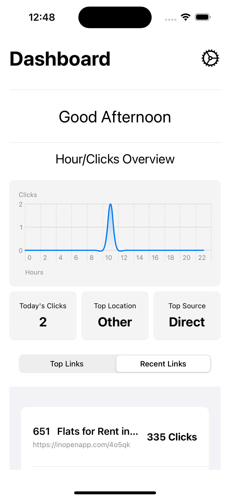
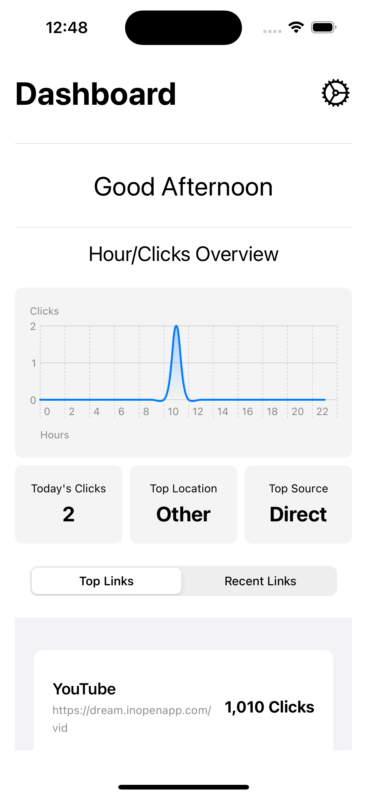

# Dashboard App

## Overview
This SwiftUI-based iOS app displays user-specific data from an API in a visually appealing and interactive way. It includes features like charts to visualize clicks over time and tab views to navigate recent and top links.

## Features
- **Authentication**: Uses bearer token for secure API access.
- **Data Visualization**: Line charts showing clicks per hour.
- **Tab Navigation**: Switch between recent and top links.
- **Adaptive UI**: Dynamic updates based on API responses.

  
## Screenshots

    
    

## ScreenRecording

https://github.com/Sarthak309/OpenInApp/assets/103929885/ae6baee1-3554-411e-afd0-4e9d9f9c1ee7

## Usage
1. Launch the app.
2. The app will fetch data from the API and display it.
3. Use the tabs to navigate between recent and top links.
4. View the line chart to see clicks per hour.

## API Integration
The app fetches data from the `https://api.inopenapp.com/api/v1/dashboardNew` endpoint using a bearer token for authentication.

## Code Structure
- `DashboardApp/`
  - `ContentView.swift`: The main view integrates other components.
  - `ViewModel.swift`: Handles API calls and data processing.
  - `ChartView.swift`: Custom line chart view.
  - `LinksView.swift`: Displays recent and top links.
  

